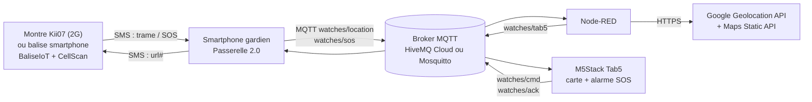

# IoT Labs — Géolocalisation cellulaire, alerte SOS et géocaching

**CFA SUPii Mécavenir — Mantes-la-Jolie · Apprentis SNPI4 & AR4**

Travaux pratiques IoT de bout en bout : une montre GSM (ou un smartphone « balise ») envoie ses **Cell-IDs** par SMS, un smartphone passerelle les publie en **MQTT**, **Node-RED** les convertit en position GPS avec l’API **Google Geolocation**, et une **M5Stack Tab5** affiche la carte et déclenche une alarme en cas de **SOS**.

> **English summary** — Hands-on IoT labs (in French) for engineering apprentices. A 2G GSM watch — or an Android phone acting as a beacon after the 2G shutdown — sends nearby cell IDs by SMS. A gateway phone relays them over MQTT (HiveMQ Cloud or a local Mosquitto broker) to Node-RED, which calls the Google Geolocation API and drives an M5Stack Tab5 display (map, movement detection, SOS alarm). Includes App Inventor projects, a custom App Inventor extension (`CellScan`) reading serving and neighbouring cells on single or dual-SIM phones, an ESP32-P4 Arduino sketch, a Node-RED flow and student worksheets.

---

## Sommaire

- [Architecture](#architecture)
- [Contenu du dépôt](#contenu-du-dépôt)
- [Les deux LABs](#les-deux-labs)
- [Démarrage rapide](#démarrage-rapide)
- [Contrat d’interface](#contrat-dinterface)
- [Extension App Inventor CellScan](#extension-app-inventor-cellscan)
- [Sécurité et vie privée](#sécurité-et-vie-privée)
- [Limites connues](#limites-connues)
- [Crédits](#crédits)
- [Licence](#licence)

---

## Architecture



| Niveau | Éléments | Rôle |
|---|---|---|
| **Local** (terminaux) | Montre / balise, smartphone passerelle, Tab5 | Mesure radio, SMS, affichage, IHM |
| **Edge** | Node-RED (+ Mosquitto en option) | Parsing, détection de mouvement, gestion du SOS, construction de la carte |
| **Cloud** | HiveMQ Cloud, Google Geolocation, Maps Static | Messagerie, base mondiale des antennes, rendu cartographique |

---

## Contenu du dépôt

```
.
├── README.md
├── .gitignore
├── nodered/
│   └── IoTLAB1_NodeRED_Kii07_Tab5.json      # flow Node-RED commun aux deux LABs
├── IoTLAB1/
│   ├── docs/
│   │   └── IoTLAB1_Kii07_Tab5_Etudiant.docx  # sujet élève (46 questions, 7 jalons)
│   └── tab5/
│       └── IoTLAB1_Tab5_Kii07/
│           └── IoTLAB1_Tab5_Kii07.ino        # programme M5Stack Tab5 (Arduino)
└── IoTLAB2/
    ├── docs/
    │   └── IoTLAB2_Balise_Smartphone_Etudiant.docx  # sujet élève (23 questions, 6 jalons)
    ├── appinventor/
    │   ├── IoTLAB2_BaliseSMS.aia             # balise : réponse à url#, SOS, 3 gardiens
    │   └── IoTLAB2_PasserelleMQTT.aia        # passerelle 2.0 : SMS → MQTT, suivi, path finder
    └── extension-cellscan/
        ├── CellScan.aix                      # extension prête à importer
        ├── build.sh                          # script de construction
        ├── icon.png
        └── src/fr/mecavenir/cellscan/CellScan.java
```

> Les **versions enseignant (corrigés)** ne sont volontairement pas publiées dans ce dépôt. Les enseignants peuvent les demander à l’auteur.

---

## Les deux LABs

### IoTLAB1 — Montre Kii07, MQTT, Node-RED et Tab5

À partir du projet [SMS-Geolocation](https://github.com/MatteoBonnet/SMS-Geolocation) de Matteo Bonnet :

- décodage de la trame SMS de la montre (MCC, MNC, LAC, CID en hexadécimal) ;
- broker **HiveMQ Cloud** (TLS 8883, ClientID, QoS, retain, LWT) ;
- passerelle App Inventor + client **Paho MQTT** ;
- Node-RED : parsing, **Google Geolocation API**, dashboard worldmap ;
- détection de mouvement (seuil adaptatif lié à la précision) et gestion du SOS ;
- programme **M5Stack Tab5** : carte Google Static Maps, bandeau d’état, alarme SOS, boutons tactiles LOCALISER / ACQUITTER ;
- activité pratique : lire les Cell-IDs autour de soi avec son smartphone (Field Test iPhone, codes Samsung, NetMonster) ;
- fil rouge **Cloud / Edge / Local**, cybersécurité, RGPD.

### IoTLAB2 — Balise smartphone après l’extinction de la 2G

La 2G s’éteint en France métropolitaine en 2026 (Orange et Free : 22 septembre – 20 octobre ; SFR et Bouygues Telecom : fin d’année). La montre Kii07, uniquement 2G, devient muette. Le défi : **transformer un smartphone Android en balise** qui parle le même « protocole SMS » que la montre.

- **BaliseIoT** : lecture des cellules 2G/3G/4G/5G sur une ou deux SIM, réponse automatique à `url#` (jusqu’à 3 gardiens autorisés), bouton SOS suivi d’une position fraîche ;
- **Passerelle 2.0** : choix du broker (Cloud HiveMQ ou Local Mosquitto), suivi en temps réel des étapes (SMS → analyse → MQTT → géolocalisation → carte), journal, carte Google, **path finder** pour jeux de géocaching (flèche orientée par la boussole, distance, itinéraire Google Maps) ;
- extension **CellScan** développée pour ce LAB (voir ci-dessous).

---

## Démarrage rapide

### 1. Broker MQTT

**Cloud — HiveMQ Cloud (offre Serverless)** : créer un cluster, puis trois identifiants (`phone-gXX`, `nodered-gXX`, `tab5-gXX`). Port **8883**, TLS obligatoire.

**Local — Mosquitto sur la machine Node-RED** :

```bash
sudo apt install mosquitto mosquitto-clients
sudo mosquitto_passwd -c /etc/mosquitto/passwd phone
sudo mosquitto_passwd /etc/mosquitto/passwd nodered
sudo mosquitto_passwd /etc/mosquitto/passwd tab5
```

`/etc/mosquitto/conf.d/iotlab.conf` :

```
listener 1883 0.0.0.0
allow_anonymous false
password_file /etc/mosquitto/passwd
```

```bash
sudo systemctl restart mosquitto
mosquitto_sub -h localhost -u nodered -P <mot_de_passe> -t "watches/#" -v
```

> Port 1883 = trafic **en clair** : à réserver à un réseau local maîtrisé.

### 2. Node-RED

1. Installer les palettes : `node-red-contrib-web-worldmap`, `node-red-dashboard`, `node-red-node-ui-table`.
2. Importer `nodered/IoTLAB1_NodeRED_Kii07_Tab5.json`.
3. Configurer le **nœud broker** (unique, partagé par tous les nœuds MQTT) :
   - Cloud : serveur `xxxx.s1.eu.hivemq.cloud`, port 8883, TLS coché, **nom du serveur (SNI)** renseigné, MQTT 3.1.1 ;
   - Local : serveur `localhost`, port 1883, TLS décoché.

   Ressaisir l’identifiant et le mot de passe : ils ne sont jamais exportés.
4. Fournir la clé Google : en tête de `~/.node-red/settings.js` :

   ```js
   process.env.GOOGLE_GEO_API_KEY = "AIza...";
   process.env.GOOGLE_MAPS_STATIC_KEY = "AIza...";
   ```

   puis redémarrer Node-RED. La clé ne se met **pas** dans le nœud *http request* (champ URL laissé vide).
5. Dans la console Google Cloud : activer **Geolocation API** et **Maps Static API**, associer un compte de facturation, restreindre la clé à ces deux API.
6. Tester avec les injects fournis ; le nœud debug **« Geo API : réponse brute »** affiche le code HTTP (200, 400, 403, 404…).

### 3. M5Stack Tab5

- Arduino IDE 2.x, gestionnaire de cartes M5Stack ≥ 3.2.2, carte **M5Tab5**, PSRAM activée.
- Bibliothèques : M5Unified, M5GFX, PubSubClient, ArduinoJson 7.
- Renseigner la section `CONFIGURATION` du sketch (Wi-Fi, broker, ClientID unique).
- `#define MQTT_USE_TLS 1` pour HiveMQ Cloud, `0` pour Mosquitto local.

### 4. Applications Android (App Inventor)

1. Sur [ai2.appinventor.mit.edu](https://ai2.appinventor.mit.edu) : *Projets → Importer un projet (.aia)*.
2. *Construire → Android App (.apk)*, installer sur le téléphone (sources inconnues autorisées).
3. Autorisations : accepter la position **précise** (indispensable à la lecture des cellules), les SMS et l’état du téléphone ; désactiver l’optimisation de batterie pour l’application.
4. **Balise** : renseigner 1 à 3 gardiens, l’ID balise (chiffres) et la SIM à lire.
5. **Passerelle 2.0** : choisir le profil de broker dans ⚙ Réglages, renseigner le numéro de la balise.

---

## Contrat d’interface

### Trames SMS

| Émetteur | Format |
|---|---|
| Montre Kii07 (réponse à `url#`) | `IMEI:869387020011400;service:[208.01.3bad.3f27@-69];neighbors:[208.01.3bad.3f26@-74]…` |
| Balise IoTLAB2 | `IMEI:0600000000;rat:lte;service:[208.01.1a2b.138860a@-87];neighbors:[…]` |
| SOS (montre et balise) | `SOS IMEI:0600000000;` |

Chaque cellule est codée `MCC.MNC.LAC/TAC.CID/CI@dBm`, LAC/TAC et CID/CI en **hexadécimal**. Le champ `rat:` (`gsm`, `wcdma`, `lte`, `nr`) est le seul ajout de la balise ; il est ignoré par un parseur plus ancien.

### Topics MQTT

| Topic | Émetteur → abonné | QoS / retain | Contenu |
|---|---|---|---|
| `watches/location` | Passerelle → Node-RED | 1 / non | Trame SMS de position |
| `watches/sos` | Passerelle → Node-RED | 1 / non | `SOS IMEI:…;` |
| `watches/tab5` | Node-RED → Tab5, passerelle | 1 / **oui** | JSON : `event`, `sos`, `lat`, `lng`, `acc`, `dist`, `ts`, `msg`, `mapUrl` |
| `watches/cmd` | Tab5 / Node-RED → passerelle | 1 / non | `url#` (la passerelle l’envoie par SMS à la balise) |
| `watches/ack` | Tab5 → Node-RED | 1 / non | `{"imei":"…"}` acquittement du SOS |
| `watches/tab5/status`, `watches/nodered/status` | LWT | 1 / oui | `online` / `offline` |

Si plusieurs groupes partagent un broker, préfixer les topics (`g03/watches/...`) dans la passerelle, Node-RED et la Tab5.

---

## Extension App Inventor CellScan

App Inventor ne fournit aucun composant donnant les Cell-IDs, et les blocs *CellId / Lac* de l’extension TaifunTM ont été retirés en 2023. **CellScan** utilise l’API Android moderne :

- `TelephonyManager.requestCellInfoUpdate()` / `getAllCellInfo()` : cellule serveuse et voisines ;
- `SubscriptionManager` + `createForSubscriptionId()` : double SIM ;
- `CellInfoLte`, `CellInfoNr`, `CellInfoGsm`, `CellInfoWcdma`.

| Bloc | Rôle |
|---|---|
| `AskPermissions` / `PermissionsResult` | Demande la position précise **et** approximative ensemble (obligatoire depuis Android 12), puis téléphone et SMS |
| `HasFineLocation`, `IsLocationEnabled`, `OpenAppSettings` | Diagnostic et accès aux réglages |
| `SimCount`, `SimInfo(slot)` | SIM actives, opérateur, MCC/MNC |
| `Scan(simSlot)` → `ScanCompleted` / `ScanFailed` | Lecture des cellules (0 = toutes les SIM) ; trame SMS prête + JSON complet |
| `SosText`, `IsLocateCommand`, `SameNumber` | Utilitaires du protocole SMS |
| `DeviceId`, `MaxNeighbors` | Identifiant de la balise, nombre de voisines par trame |

**Reconstruire l’extension** (JDK 11+) :

```bash
git clone --depth 1 --filter=blob:none --sparse https://github.com/mit-cml/appinventor-sources
cd appinventor-sources
git sparse-checkout set appinventor/components/src appinventor/common/src appinventor/lib
cd ../IoTLAB2/extension-cellscan
AI_SOURCES=../../appinventor-sources bash build.sh   # produit CellScan.aix
```

---

## Sécurité et vie privée

- **Ne jamais committer** de clé API, de mot de passe MQTT ou de SSID/mot de passe Wi-Fi. Les fichiers du dépôt ne contiennent que des valeurs d’exemple (`AIza...`, `xxxx.s1.eu.hivemq.cloud`, `VOTRE_SSID`). Vérifier avant chaque `git push`, en particulier le flow Node-RED si des variables d’environnement ont été définies sur l’onglet.
- Restreindre les clés Google (API autorisées, quotas, alertes budgétaires) et les faire tourner après chaque session.
- La position d’une personne est une **donnée personnelle** (RGPD) : informer et obtenir le consentement du porteur, limiter la conservation, préférer un hébergement dans l’UE.
- Le numéro d’émetteur d’un SMS peut être usurpé : le filtrage par numéro n’est pas une authentification forte.
- Les codes de diagnostic des téléphones (`*3001#12345#*`, `*#0011#`, `*#*#4636#*#*`) servent **uniquement à lire** : ne modifier aucun paramètre et ne pas taper d’autres codes trouvés en ligne.

---

## Limites connues

- **Précision** : la géolocalisation cellulaire est de l’ordre de **quelques centaines de mètres à quelques kilomètres**. Pour du géocaching précis, ajouter la position GPS de la balise (évolution proposée dans IoTLAB2).
- **Android** : la balise et la passerelle doivent rester ouvertes (optimisation de batterie désactivée) pour répondre de façon fiable.
- **Double SIM** : les SMS partent de la SIM SMS par défaut ; une trame ne contient qu’une seule technologie radio.
- **Montre Kii07** : inutilisable après l’extinction de la 2G de son opérateur.
- Les projets `.aia` et l’extension CellScan ont été construits avec les outils officiels d’App Inventor mais doivent être **validés sur vos téléphones** avant une séance ; les retours (issues) sont les bienvenus.

---

## Crédits

- [SMS-Geolocation](https://github.com/MatteoBonnet/SMS-Geolocation) — Matteo Bonnet : flow Node-RED et passerelle App Inventor d’origine.
- [UrsPahoMqttClient](https://ullisroboterseite.de/android-AI2-PahoMQTT-en.html) — extension App Inventor MQTT (Eclipse Paho), Ullis Roboterseite.
- [MIT App Inventor](https://appinventor.mit.edu) — environnement et processeurs d’annotations utilisés pour construire CellScan.
- [M5Stack](https://m5stack.com) — M5Unified / M5GFX ; [PubSubClient](https://github.com/knolleary/pubsubclient) ; [ArduinoJson](https://arduinojson.org).
- [Node-RED](https://nodered.org), [HiveMQ Cloud](https://www.hivemq.com/cloud/), [Eclipse Mosquitto](https://mosquitto.org).

---

## Licence

À définir par l’auteur avant publication. Proposition :

- **Code** (sketch Tab5, extension CellScan, flow Node-RED, projets App Inventor) : [MIT](https://opensource.org/license/mit) ;
- **Documents pédagogiques** : [CC BY-NC-SA 4.0](https://creativecommons.org/licenses/by-nc-sa/4.0/deed.fr).

Vérifier la licence du dépôt d’origine SMS-Geolocation et celle de l’extension UrsPahoMqttClient, redistribuée dans les fichiers `.aia`.
